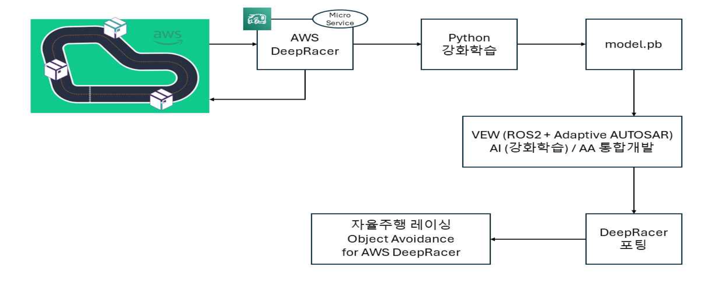
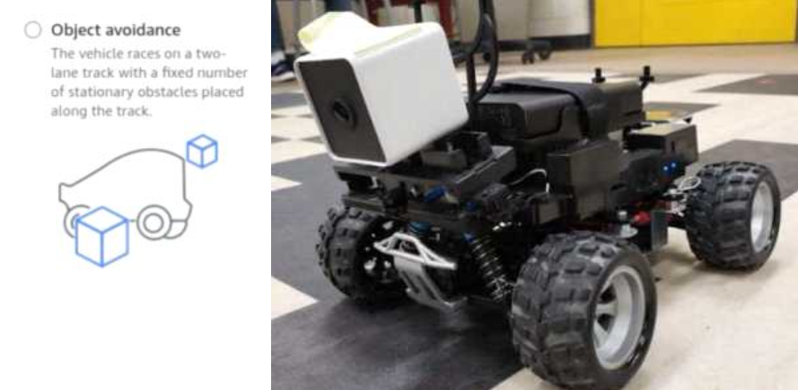
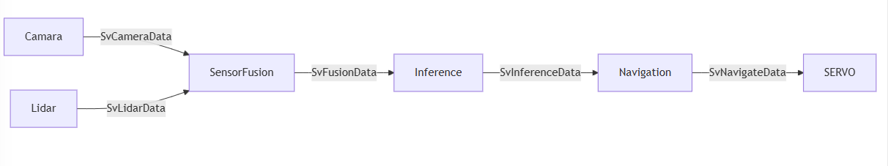
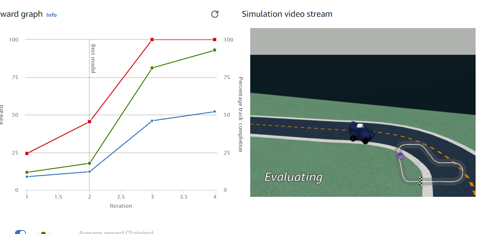
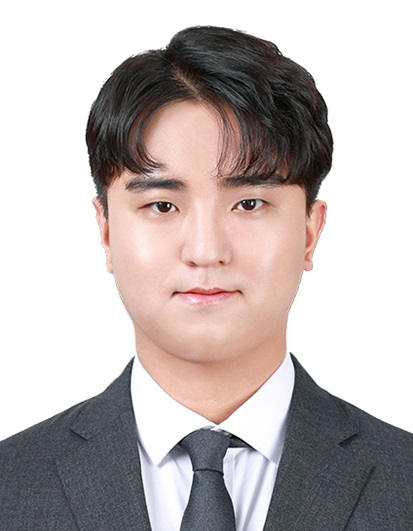
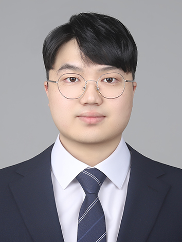
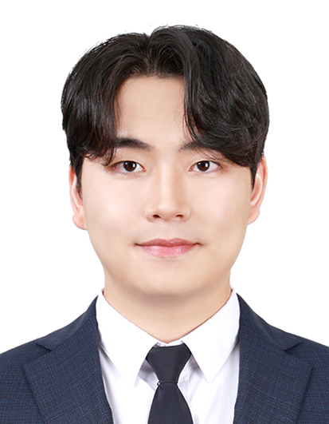

강화학습 모델명 : jangdeokdong-model-3

# 제 22회 임베디드 소프트웨어 경진대회 자율주행 레이싱 부문 결선 진출작

## 팀 장덕동왕족발보쌈

## 과제 목표

- Adaptive AUTOSAR의 구조와 작동 원리를 이해하고, 플랫폼 설정 및 통신 스택 학습을
  통한 자율주행 소프트웨어 개발의 기초 마련.
- Amazon SageMaker를 활용해 강화학습 모델의 파라미터 수정을 통해 자율주행 성능을 향상.
- Amazon DeepRacer와 AA기반 애플리케이션을 통합해 상황 인지, 객체 탐지, 최적 경로 탐색을 구현.
- Cloud Native 기반 환경에서 Adaptive Application을 개발하고, AWS DeepRacer 에 성공적으로 적용.

## 개발 방향

<p align="left">
 
</p>

- Camera, Lidar, SensorFusion, Inference, Navigation AA의 역할과 상호 작용을 명확히 규정해 시스템의 일관성과 확장성을 확보.

- Popcornsar의 PARA를 통해 EM 과 SM을 제공받아 플랫폼 레벨에서 필요한 애플리케이션을 구동시키는 데 활용.

## 기술 스택

| Tech | Stack |
| --- | --- |
| Language | C++11/14 (ISO14882), Python3(DeepRacer 강화학습 용) |
| Standard | Adaptive AUTOSAR (R20-11) |
| H/W | Object avoidance for AWS DeepRacer (카메라 2대, 라이다 1대) |
| Tools | `PARA`, iox-roudi, CMake , Git, Github, Jira |
| IDE | `AutoSAR.io` , VSCode |
<p align="left">
 
</p>


## 설계
  <p align="left">
    
  </p>

- SOA를 채택해 각 AA 간의 효율적인 통신과 데이터 처리를 중심으로 구성함.

- PoncornSAR의 ARXML 설계 솔루션인 AUTOSAR.io 를 활용해 SOA 개발 방식을 채택함으로써 시스템의 확장성과 유지보수성을 높일 수 있게 설계함.

- 각 Adaptive Application의 통신은 SOME/IP 미들웨어 방식을 채택해 EVENT 방식으로 통신하게 설계함.


## Adaptive Application 개발
개발의 효율성을 위해 Perception, Decision, Execution 파트로 나눠 개발을 진행함.
- ### Perception (Camera, Lidar, SensorFusion)
    
    - Perception 모듈은 높은 성능을 유지하기 위해 비동기 작업과 멀티스레딩을 적극 활용해 각 센서의 데이터를 병렬로 처리함. 이를 통해 데이터 수집과 전송 과정의 지연을 최소화하고, 주행 중 빠르게 변하는 환경 정보를 실시간으로 수집하여 정확한 인식 데이터를 제공함.
    - Camera와 Lidar에서 제공하는 데이터는 각 프레임에 타임스탬프가 포함되어 SensorFusion 모듈에서 동기화해 데이터의 일관성을 보장하며, 주행 중 정확한 인식 결과를 제공함. 이를 통해 차량이 실시간으로 상황을 파악해 안정적인 주행을 이어갈 수 있게 개발함.

- ### Decision (Inference)
    - Decision 모듈의 Inference는 차량의 주행 결정을 담당하는 핵심 요소로, AWS DeepRacer와 Amazon SageMaker를 활용해 강화학습 모델을 개발함.
    - AWS DeepRacer는 자율주행 차량의 강화학습을 위한 플랫폼으로, 가상 환경에서 모델을 훈련하고 최적의 모델을 추출하여 Adaptive Application(AA)로 이식하는 과정을 통해 실차 적용을 가능하게 함.

- ### Execution (Navigation, Lidar)
    - Execution 모듈은 차량이 주어진 경로를 따라 안전하고 정확하게 주행할 수 있도록 Navigate AA와 Servo AA로 구성되어 있으며, 차량의 방향 ,속도, 제동을 실시간으로 제어하는 역할을 수행하게 개발함.

## 테스트

- ### 환경 설정 및 시나리오 구축
    
    시뮬레이션을 통해 Camera와 Lidar 센서 데이터의 동기화 성능과 SensorFusion의 데이터 통합 정확도를 확인하였으며, 센서 간 데이터 오차가 줄어들고, 정확도가 높아짐.
    
    - 강화학습 모델 평가 및 튜닝
            <p align="left">
              
            </p>
        - 시뮬레이터에서 강화학습 모델을 반복적으로 평가하여 차량이 최적의 주행 경로와 장애물 회피 경로를 안정적으로 따를 수 있도록 함. 
        초기 테스트에서는 장애물 회피 성공률이 낮았으나, 보상 함수를 조정한 후 회피 성능이 약 20% 향상함.

        - 모델 튜닝을 통해 학습된 경로 유지 및 장애물 회피 성능이 개선되었으며, 이를 통해 주행 궤적의 정확성이 증가하고 전체 주행 시간이 감소함.

    - 주행 명령의 실시간 응답성 테스트
        
        - 시뮬레이터에서 Servo 모듈을 통한 PWM 신호 전달이 실시간으로 반영되는지 검증함. 조향과 속도 명령이 즉각적으로 반응하여 차량이 주행 중 지연 없이 명령을 수행할 수 있음을 확인함.
        
- ### 실차 주행 테스트
    <p align="left">
      
    </p>
    대회 측에서 제공한 트랙을 기반으로 테스트를 진행함. 트랙은 직선 구간과 곡선 구간, 장애물 구간으로 구성하여 실제 주행 환경과 유사한 환경에서 테스트함.
  
    - AA별 개별 테스트
        
        - PopcornSAR의 iox-roudi 를 활용해 각 AA 모듈을 개별적으로 테스트해 Camera와 Lidar의 동기화, SensorFusion의 데이터 통합, Inference AA의 주행 경로 예측이 정확하게 이루어지는지 확인함.
        
    - 주행 경로 및 장애물 회피 성능 테스트
        
        - 강화학습을 통해 생성된 주행 경로와 장애물 회피 경로를 따라 차량이 정확히 주행할 수 있음을 확인함.
        
        - Navigate와 Servo AA가 연동되어 조향 및 속도 정보를 주고받는 것을 확인함.
        
        - Event 기반 서비스 인터페이스를 채택하여 응답 피드백 속도의 향상과 경로 추종을 구현한 결과 통신 성능이 약 15% 향상되었음.
        
        - 급격한 회전이나 장애물 인식 상황에서도 지연을 최소화된 상태로 조향과 속도 제어가 이루어졌고, 주행 중 발생할 수 있는 위험 요소(충돌 등)가 최소로 구현함.


## 실차 주행 영상

  <p align="left">
    
  </p>
        
<a href="https://www.youtube.com/watch?v=9_1Xo4drMzE" target="_blank">
  
</a>

## 대회 결과

- 대회 결선 주행 순위 : 공동 3위
- 최종 대회 결과 : 임베디드 소프트웨어 경진대회 자율주행 레이싱 부문 장려상(3위, AWS Public Edutech상)
## 팀원소개
- 대회 참여 기간 : 2024년 7월 9일~ 2024년 11월 17일
- 개발기간: 2024년 8월 14일 ~ 2024년 11월 17일 (14주)


|       이민규       |       고광현       |       전규훈       |       정진솔       |
| :----------------: | :----------------: | :----------------: | :----------------: |
|        팀장         |        팀원         |        팀원         |        팀원         |
|  |  |  |  |
| ARXML 설계, Inference AA 개발 | Navigate AA, Servo AA 개발 | 강화학습 모델 구축 및 최적화, Inference AA 개발 | Camera AA, Lidar AA, SensorFusion AA 개발 |


## 빌드 및 실행 방법

```bash
$ cmake -B build -D CMAKE_INSTALL_PREFIX=$PARA_SDK -D InferenceEngine_DIR="/opt/intel/openvino_2021.1.110/deployment_tools/inference_engine/share" -D ngraph_DIR="/opt/intel/openvino_2021.1.110/deployment_tools/ngraph/cmake"

$ cmake --build build -j $(nproc)

$ cmake --install build

${Para_SDK}/bin/.EM

```
